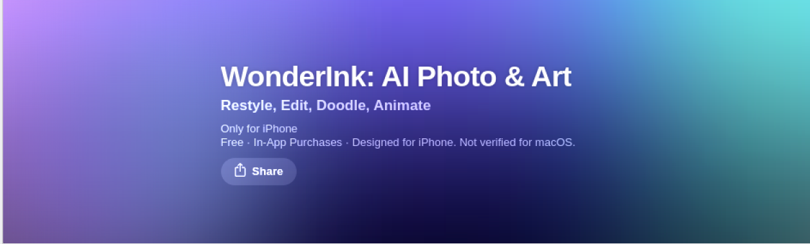
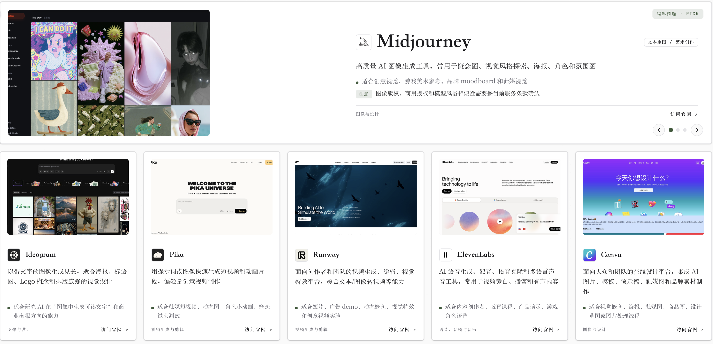
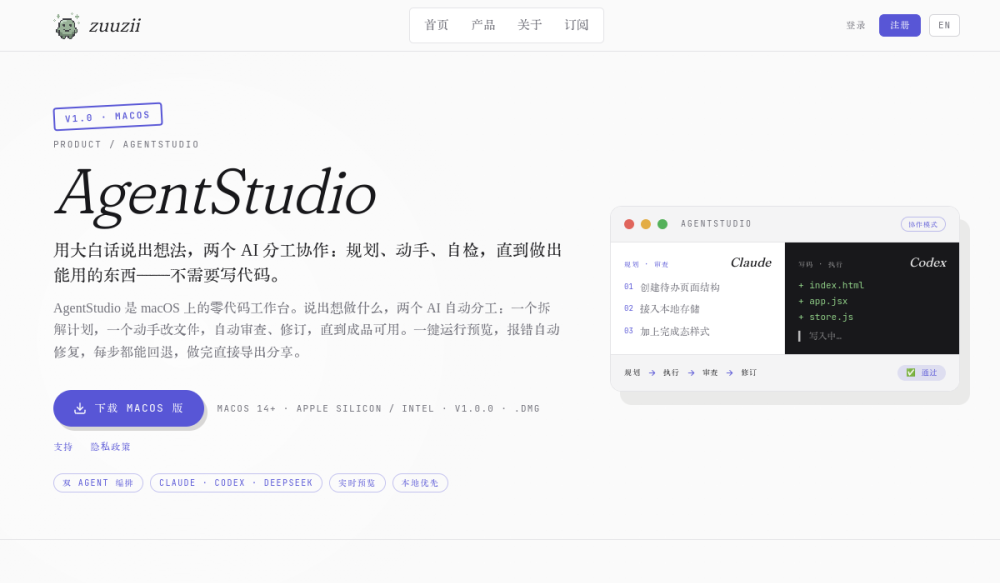
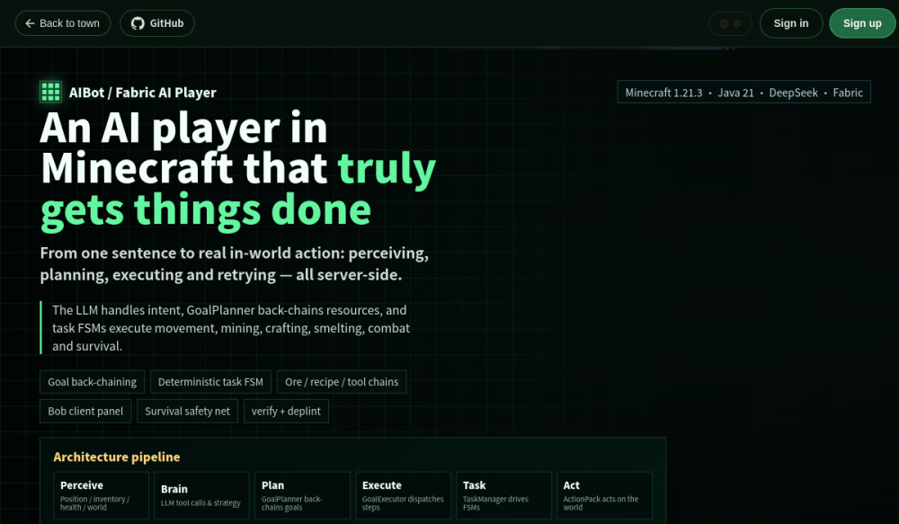

<div align="center">

<!-- ┌────────────────────────  打字机动画 / Typing Animation  ────────────────────────┐ -->
<!-- 改标语:替换 URL 里 lines= 后的内容(空格用 + ,短语用 ; 分隔)                       -->

[](https://github.com/zoyluoblue)

**做产品,也写代码。把想法,变成现实。**
*Builder by craft · Maker by heart.*

</div>

<details>
<summary><code>$ ./zoy --about</code> &nbsp;·&nbsp; 点开看看 / click me 👀</summary>

```bash
zoy@earth:~$ neofetch
─────────────────────────────────────────────
  Role      : Indie Hacker / Founder
  Building  : zuuzii.com   🚀  把 AI 放回真实世界的秩序里
  Writing   : zoytown.com  🏡  一座正在长大的数字小镇
  Stack     : TypeScript · Python · Go
  Editor    : VS Code · Neovim
  Uptime    : ∞   ·   Fuel : ☕ coffee + 🎧 lo-fi
─────────────────────────────────────────────
```

</details>


### 🚀 zuuzii.com — 我们的产品 / Our Product

<a href="https://zuuzii.com" target="_blank" rel="noopener noreferrer">
  
</a>

> 🧩 **把 AI 放回真实世界的秩序里。**
> 让 AI 不止于炫技,而是落到真实的场景与秩序中,产生可靠、可用的价值。
>
> *Bringing AI back into the order of the real world.*


### 🏡 zoytown.com — 我的个人站 / Personal Space

<a href="https://zoytown.com" target="_blank" rel="noopener noreferrer">
  
</a>

> 🌱 **一座正在长大的数字小镇。**
> 在这里安放想法、作品与好奇心 —— 一砖一瓦,慢慢建造。
>
> *A digital town that's still growing — built brick by brick.*


### ✨ 精选作品 / Featured Work

<!-- 想换更干净的截图?把对应图片丢进 assets/ 同名覆盖即可(wonderink.png / aihunter.png / agentstudio.png / mc-aiplayer.png) -->

<!-- ───── ★ WonderInk(新上线 · App Store · 图左 / 文右)───── -->
<table>
<tr>
<td width="58%">
<a href="https://apps.apple.com/app/id6779648706" target="_blank" rel="noopener noreferrer"></a>
</td>
<td width="42%" valign="top">
<h3>🎨 WonderInk</h3>
<p><b>四种 AI 创作工具,装进你的口袋。</b><br/>
一站式 AI 创作工坊:人像重绘(12 种画风)、一句话智能修图(上色 / 扩图 / 超分 / 去水印)、涂鸦秒变作品、照片一键动成 5 秒短片。作品全部留在本机,上传仅用于生成、绝不留存。</p>
<p><sub><i>Four AI creation tools in your pocket — restyle portraits, edit by instruction, turn doodles into art, and bring photos to life. Everything stays on your device.</i></sub></p>
<p>


</p>
<a href="https://apps.apple.com/app/id6779648706" target="_blank" rel="noopener noreferrer"></a>
</td>
</tr>
</table>

<!-- ───── 1 · AI Hunter(图左 / 文右)───── -->
<table>
<tr>
<td width="58%">
<a href="https://aihunter.zuuzii.com" target="_blank" rel="noopener noreferrer"></a>
</td>
<td width="42%" valign="top">
<h3>🛰️ AI Hunter</h3>
<p><b>在 AI 的浪潮里,替你筛出真正值得用的工具。</b><br/>
一座持续更新的中文 AI 工具图谱:从图像、视频、写作到编程与企业级平台,<b>15+ 分类</b>、人工甄选 —— 把噪音挡在门外,只留下当下最值得上手的那一个。</p>
<p><sub><i>Signal over noise — a curated, daily-updated atlas of the AI tools actually worth your time.</i></sub></p>
<p>


</p>
<a href="https://aihunter.zuuzii.com" target="_blank" rel="noopener noreferrer"></a>
</td>
</tr>
</table>

<!-- ───── 2 · AgentStudio(图左 / 文右)───── -->
<table>
<tr>
<td width="58%">
<a href="https://zuuzii.com/productions/agentstudio/" target="_blank" rel="noopener noreferrer"></a>
</td>
<td width="42%" valign="top">
<h3>🎛️ AgentStudio</h3>
<p><b>说一句话,两个 AI 替你把它做出来。</b><br/>
macOS 上的零代码工作台:双 Agent 各司其职 —— 一个规划与审查,一个编码与执行,实时预览、报错自动回退自愈,直到交付一个真正跑得起来的成品。把「想法到产品」压缩进一次对话。</p>
<p><sub><i>Describe it once. A planner and a builder orchestrate it into a working product — idea to shipped, in a single conversation.</i></sub></p>
<p>


</p>
<a href="https://zuuzii.com/productions/agentstudio/" target="_blank" rel="noopener noreferrer"></a>
</td>
</tr>
</table>

<!-- ───── 3 · AIBot / MC AI Player(图左 / 文右)───── -->
<table>
<tr>
<td width="58%">
<a href="https://www.zoytown.com/items/mc_aiplayer" target="_blank" rel="noopener noreferrer"></a>
</td>
<td width="42%" valign="top">
<h3>🎮 AIBot · MC AI Player</h3>
<p><b>会思考、能生存的 Minecraft 自主智能体。</b><br/>
一个服务端 Fabric Mod:大模型负责「想」(目标回溯式规划),确定性任务状态机负责「做」(挖矿、合成、战斗、生存)。感知 → 规划 → 执行 → 重试 —— 一个真正能在世界里自洽行动的 AI 玩家。</p>
<p><sub><i>An autonomous agent that lives in Minecraft — LLM reasoning on top, deterministic task machines below. Perceive, plan, act, retry — all server-side.</i></sub></p>
<p>


</p>
<a href="https://www.zoytown.com/items/mc_aiplayer" target="_blank" rel="noopener noreferrer"></a>
</td>
</tr>
</table>


### 🛠️ 技术栈 / Tech Stack

<!-- 编辑提示:增删图标只需改 URL 里 i= 后的代号,全部代号见 https://skillicons.dev -->
<div align="center">


</div>


### 📫 联系我 / Connect

<div align="center">

<a href="https://zuuzii.com" target="_blank" rel="noopener noreferrer"></a>
<a href="https://zoytown.com" target="_blank" rel="noopener noreferrer"></a>
<a href="https://github.com/zoyluoblue" target="_blank" rel="noopener noreferrer"></a>

</div>


<!-- ┌──────────  贡献贪吃蛇 / Contribution Snake  ──────────┐ -->
<!-- 需启用 .github/workflows/snake.yml,首次跑完 Action 后才会显示 -->
<div align="center">

<picture>
  <source media="(prefers-color-scheme: dark)" srcset="https://raw.githubusercontent.com/zoyluoblue/zoyluoblue/output/github-contribution-grid-snake-dark.svg" />
  <source media="(prefers-color-scheme: light)" srcset="https://raw.githubusercontent.com/zoyluoblue/zoyluoblue/output/github-contribution-grid-snake.svg" />
  
</picture>

<br/>

<!-- 固定引言 / fixed quote -->
<em>&ldquo;All the moments will be lost in time, like tears in rain.&rdquo;</em>
<br/>
<sub>— Roy Batty · <i>Blade Runner</i> (1982)</sub>

</div>


